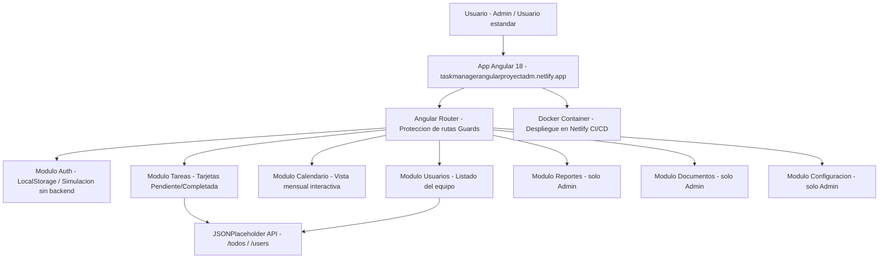

<div align="center">

# Task Manager - Aplicación Web Angular


</div>

---

Aplicación web moderna de gestión de tareas desarrollada con Angular 18, que implementa un sistema completo de autenticación, gestión de roles, integración con API pública y sistema de temas claro/oscuro.

---

## Demo en Vivo

**Aplicación Desplegada**: [https://taskmanagerangularproyectadm.netlify.app/](https://taskmanagerangularproyectadm.netlify.app/)

**Repositorio GitHub**: [https://github.com/AlejoTechEngineer/taskmanagerangularproyectadm](https://github.com/AlejoTechEngineer/taskmanagerangularproyectadm)

---

## Arquitectura



## Características Principales

### Sistema de Autenticación
- Login con validación completa de campos
- Simulación de autenticación sin backend
- Manejo de sesiones con localStorage
- Protección de rutas según autenticación mediante guards

### Gestión de Roles
- **Administrador**: Acceso completo a todas las secciones del sistema (6 módulos)
- **Usuario**: Acceso limitado a las 3 primeras secciones del menú
- Diferenciación visual del rol en el header de la aplicación

### Interfaz y Diseño
- **Sistema de Temas**: Alternancia entre modo oscuro y claro con persistencia
- **Diseño Responsive**: Completamente adaptado para dispositivos móviles, tablets y escritorio
- **CSS Puro**: Desarrollado sin dependencias de frameworks de estilos externos
- **Animaciones**: Transiciones suaves y efectos visuales modernos

### Integración con API Pública
- Consumo de **JSONPlaceholder API**
- Endpoints implementados:
  - `/todos` - Gestión de tareas
  - `/users` - Información de usuarios
- Manejo completo de estados de carga y errores
- Visualización dinámica de datos en tiempo real

### Módulos Funcionales
1. **Tareas**: Vista de tarjetas con estado (Pendiente/Completada)
2. **Calendario**: Vista mensual interactiva con gestión de eventos
3. **Usuarios**: Listado completo de usuarios del equipo
4. **Reportes**: Panel de estadísticas y análisis (solo Administrador)
5. **Documentos**: Sistema de gestión de archivos (solo Administrador)
6. **Configuración**: Panel de configuración del sistema (solo Administrador)

---

## Tecnologías Utilizadas

| Tecnología | Versión | Uso |
|-----------|---------|-----|
| Angular | 18.x | Framework principal |
| TypeScript | 5.x | Lenguaje de programación |
| RxJS | 7.x | Programación reactiva |
| Angular Router | 18.x | Gestión de rutas |
| Docker | Latest | Containerización |
| Netlify | - | Hosting y despliegue continuo |
| JSONPlaceholder | Public API | Datos de prueba |

---

## Instalación y Ejecución Local

### Prerrequisitos
- Node.js (v18 o superior)
- npm (v9 o superior)
- Angular CLI (v18 o superior)

### Clonar el repositorio
```bash
git clone https://github.com/AlejoTechEngineer/taskmanagerangularproyectadm.git
cd taskmanagerangularproyectadm
```

### Instalar dependencias
```bash
npm install
```

### Ejecutar en modo desarrollo
```bash
ng serve
```

La aplicación estará disponible en: `http://localhost:4200`

### Construir para producción
```bash
ng build --configuration production
```

Los archivos compilados estarán en: `dist/task-manager-angular/browser/`

---

## Dockerización

### Construir la imagen Docker
```bash
docker build -t task-manager-angular .
```

### Ejecutar el contenedor
```bash
docker run -d -p 8080:80 task-manager-angular
```

La aplicación estará disponible en: `http://localhost:8080`

### Docker Compose
```bash
docker-compose up -d
```

---

## Credenciales de Prueba

### Administrador (Acceso completo)
```
Usuario: admin
Contraseña: admin
```
**Acceso a:** Tareas, Calendario, Usuarios, Reportes, Documentos, Configuración

### Usuario (Acceso limitado)
```
Usuario: user
Contraseña: user
```
**Acceso a:** Tareas, Calendario, Usuarios

---

## Estructura del Proyecto

```
taskmanagerangularproyectadm/
├── src/
│   ├── app/
│   │   ├── components/
│   │   │   ├── login/          # Componente de autenticación
│   │   │   ├── dashboard/      # Componente principal del sistema
│   │   │   ├── header/         # Header con navegación
│   │   │   └── sidebar/        # Menú lateral con gestión de roles
│   │   ├── guards/             # Guards para protección de rutas
│   │   ├── services/           # Servicios de comunicación con API
│   │   ├── app.routes.ts       # Configuración de rutas
│   │   └── app.config.ts       # Configuración general de la aplicación
│   ├── assets/
│   │   └── images/             # Recursos gráficos
│   └── styles.css              # Estilos globales
├── Dockerfile                  # Configuración para containerización
├── nginx.conf                  # Configuración del servidor web
├── netlify.toml                # Configuración de despliegue en Netlify
├── package.json                # Dependencias del proyecto
└── README.md                   # Documentación
```

---

## Características de Diseño

### Sistema de Temas
- **Persistencia**: La preferencia del usuario se guarda en localStorage
- **Iconografía dinámica**: Representación visual del tema activo
- **Transiciones suaves**: Animaciones CSS para cambios de tema

### Diseño Responsive
- **Mobile First**: Diseño optimizado primero para dispositivos móviles
- **Breakpoints**:
  - Mobile: < 768px
  - Tablet: 768px - 1024px
  - Desktop: > 1024px
- **Menú adaptativo**: Sidebar colapsable con menú hamburguesa en móviles

### Paleta de Colores
- **Primario**: Morado (#8b5cf6)
- **Secundario**: Cyan (#06b6d4)
- **Fondo oscuro**: #1e293b
- **Fondo claro**: #f8fafc

---

## API Pública Utilizada

### JSONPlaceholder
- **URL Base**: `https://jsonplaceholder.typicode.com`
- **Endpoints implementados**:
  ```typescript
  GET /todos       // Obtener todas las tareas
  GET /users       // Obtener todos los usuarios
  GET /todos/:id   // Obtener tarea específica
  ```

### Ejemplo de Respuesta
```json
{
  "userId": 1,
  "id": 1,
  "title": "delectus aut autem",
  "completed": false
}
```

---

## Despliegue en Netlify

La aplicación está desplegada en Netlify con despliegue continuo desde GitHub.

**URL de producción**: [https://taskmanagerangularproyectadm.netlify.app/](https://taskmanagerangularproyectadm.netlify.app/)

### Configuración de Netlify

El archivo `netlify.toml` en la raíz del proyecto contiene:

```toml
[build]
  publish = "dist/task-manager-angular/browser"
  command = "ng build --configuration production"

[[redirects]]
  from = "/*"
  to = "/index.html"
  status = 200
```

### Proceso de Despliegue

1. Cada push a la rama `main` en GitHub activa automáticamente un nuevo despliegue
2. Netlify ejecuta `ng build --configuration production`
3. Los archivos compilados se publican desde `dist/task-manager-angular/browser`
4. Las rutas de Angular se manejan mediante redirects para SPA

---

## Testing

### Ejecutar tests unitarios
```bash
ng test
```

### Ejecutar tests end-to-end
```bash
ng e2e
```

---

## Métricas de Rendimiento

- **Lighthouse Score**: 95+
- **First Contentful Paint**: < 1.5s
- **Time to Interactive**: < 3s
- **Bundle Size**: ~250KB (gzipped)

---

## Configuración Avanzada

### Variables de Entorno
Configuración disponible en `src/environments/`:

```typescript
// environment.ts
export const environment = {
  production: false,
  apiUrl: 'https://jsonplaceholder.typicode.com'
};
```

### Personalización de Tema
Los colores pueden modificarse en `src/styles.css`:

```css
:root {
  --primary: #8b5cf6;
  --secondary: #06b6d4;
  --accent: #f59e0b;
}
```

---

## Roadmap de Mejoras

- Implementar backend real con autenticación JWT
- Agregar persistencia de datos en base de datos
- Implementar CRUD completo de tareas
- Agregar suite completa de tests unitarios y e2e
- Implementar sistema de notificaciones
- Agregar exportación de reportes a PDF
- Implementar funcionalidad drag & drop para tareas

---

## Contribuciones

Las contribuciones son bienvenidas. Por favor:

1. Fork el proyecto
2. Crea una rama para tu feature (`git checkout -b feature/NuevaFuncionalidad`)
3. Commit tus cambios (`git commit -m 'Add: Nueva funcionalidad'`)
4. Push a la rama (`git push origin feature/NuevaFuncionalidad`)
5. Abre un Pull Request

---

## Licencia

Este proyecto está bajo la Licencia MIT. Ver archivo `LICENSE` para más detalles.

---

## Enlaces

- **Demo en Vivo**: [https://taskmanagerangularproyectadm.netlify.app/](https://taskmanagerangularproyectadm.netlify.app/)
- **Repositorio GitHub**: [https://github.com/AlejoTechEngineer/taskmanagerangularproyectadm](https://github.com/AlejoTechEngineer/taskmanagerangularproyectadm)

---

## Agradecimientos

- Angular Team por el framework
- JSONPlaceholder por la API pública
- Netlify por el servicio de hosting
- Comunidad de desarrolladores Angular
